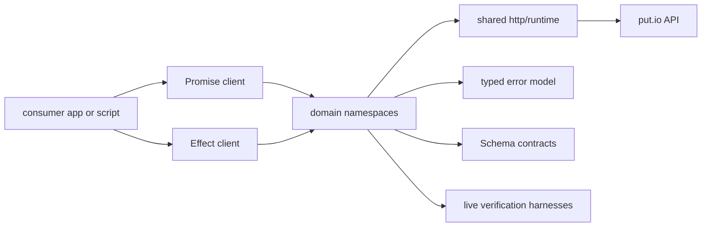
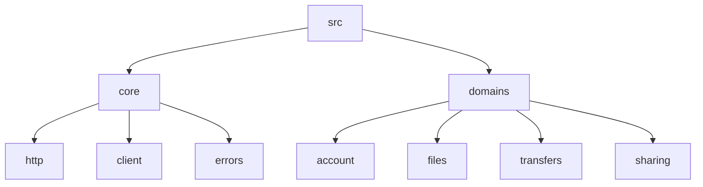

# SDK Overview

## Goal

Explain the actual `@putdotio/sdk` package shape for humans and agents.

## System View

## Components

| Component           | Responsibility                                                 |
| ------------------- | -------------------------------------------------------------- |
| Promise client      | ergonomic app-facing entrypoint with managed runtime ownership |
| Effect client       | Effect-native entrypoint for workflows                         |
| Domain namespaces   | grouped API operations by domain                               |
| Shared HTTP runtime | fetch-native transport, auth resolution, base URLs             |
| Error model         | transport, validation, and operation-aware failures            |
| Live verification   | runtime verification against real put.io accounts              |

## Namespace Layout

The source currently lives in:

- `src/core/*.ts` for shared runtime, transport, defaults, and client composition
- `src/domains/*.ts` for domain namespaces

The current package layout is:

This split is the stable default unless a domain grows large enough to earn its own subfolder.

## Direct Access and Upload

The `files` namespace owns both:

- JSON operations like `files.get(...)`, `files.list(...)`, `files.extract(...)`
- direct route helpers like `files.getApiDownloadUrl(...)`, `files.getApiContentUrl(...)`, `files.getHlsStreamUrl(...)`
- upload helpers like `files.createUploadRequest(...)` and `files.upload(...)`

That split is deliberate:

- route helpers are transport-shaped
- JSON methods are schema-shaped
- upload is special because it goes through `upload.put.io`

## Runtime Model

| Concern      | Choice                                               |
| ------------ | ---------------------------------------------------- |
| Core runtime | `effect`                                             |
| Transport    | `@effect/platform` `HttpClient`                      |
| Validation   | `Schema`                                             |
| Auth         | config token, explicit token, basic auth, or no-auth |
| Portability  | standard Web APIs first                              |

The Promise client owns a managed Effect runtime per client instance and exposes `dispose()` so host applications can tear it down explicitly.

## What This Package Is Not

- not a `putio-js` compatibility wrapper
- not an axios-era helper bag
- not a UI-localized error layer
- not a progress-task runtime for uploads

## Verification Model

Use three layers:

1. static checks: lint, format, typecheck, package build
2. live tests in `test/live`
3. source verification against backend, current frontend consumers, and archived `putio-js`

## Release Model

- `main` is the release branch
- pushes to `main` verify first, then `semantic-release` publishes and tags the release
