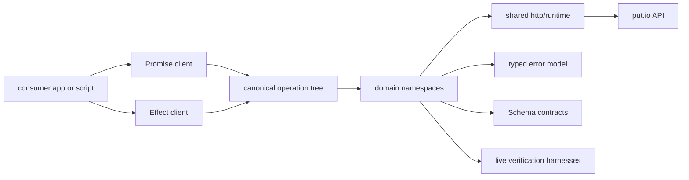
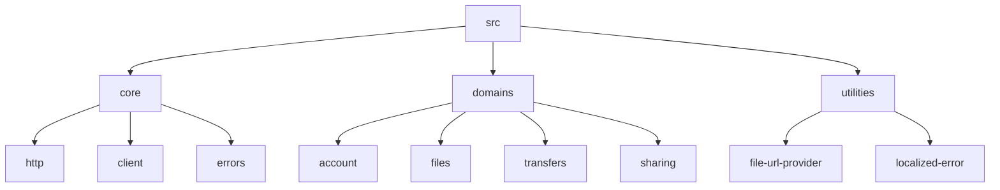

# SDK Overview

## Goal

Explain the actual `@putdotio/sdk` package shape for humans and agents.

## System View

```mermaid
graph LR
  Consumer["consumer app or script"] --> Promise["Promise client"]
  Consumer --> EffectClient["Effect client"]
  Promise --> Operations["canonical operation tree"]
  EffectClient --> Operations
  Operations --> Domains["domain namespaces"]
  Domains --> Http["shared http/runtime"]
  Domains --> Errors["typed error model"]
  Domains --> Schemas["Schema contracts"]
  Http --> API["put.io API"]
  Domains --> Live["live verification harnesses"]
```

## Components

| Component           | Responsibility                                                 |
| ------------------- | -------------------------------------------------------------- |
| Promise client      | ergonomic app-facing entrypoint with managed runtime ownership |
| Effect client       | Effect-native entrypoint and service for workflows             |
| Domain namespaces   | grouped API operations by domain                               |
| Utilities subpath   | file URLs, localized errors, and shared formatting helpers     |
| Shared HTTP runtime | fetch-native transport, auth resolution, base URLs             |
| Error model         | transport, validation, and operation-aware failures            |
| Live verification   | runtime verification against real put.io accounts              |

## Namespace Layout

The source currently lives in:

- `src/core/*.ts` for shared runtime, transport, defaults, and client composition
- `src/domains/*.ts` for domain namespaces
- `src/utilities/*.ts` for opt-in helper utilities exported from `@putdotio/sdk/utilities`

The current package layout is:

```mermaid
graph TD
  SDK["src"] --> Core["core"]
  SDK --> Domains["domains"]
  SDK --> Utilities["utilities"]
  Core --> Http["http"]
  Core --> Client["client"]
  Core --> Errors["errors"]
  Utilities --> Urls["file-url-provider"]
  Utilities --> Localized["localized-error"]
  Domains --> Account["account"]
  Domains --> Files["files"]
  Domains --> Transfers["transfers"]
  Domains --> Sharing["sharing"]
```

This split is the stable default unless a domain grows large enough to earn its own subfolder.

## Direct Access and Upload

The `files` namespace owns both:

- JSON operations like `files.get(...)`, `files.list(...)`, `files.extract(...)`
- direct route helpers like `files.getApiDownloadUrl(...)`, `files.getApiContentUrl(...)`, `files.getHlsStreamUrl(...)`
- upload helpers like `files.createUploadRequest(...)` and `files.upload(...)`

That split is deliberate:

- route helpers are transport-shaped
- JSON methods are schema-shaped
- upload is special because it goes through `upload.put.io`

## Runtime Model

| Concern      | Choice                                               |
| ------------ | ---------------------------------------------------- |
| Core runtime | `effect`                                             |
| Transport    | SDK-owned `PutioHttpClient` service over `fetch`     |
| Validation   | `Schema`                                             |
| Auth         | config token, explicit token, basic auth, or no-auth |
| Portability  | standard Web APIs first                              |

The Effect client is available as both a factory value and a `PutioSdk` service layer for workflows that prefer dependency injection.
`makePutioSdkLiveClientLayer(...)` composes the SDK service, SDK config, and fetch-backed transport for the normal live boundary.
Both clients are assembled from one typed operation tree. The Promise client adapts its Effect operations through one managed runtime per client instance, while keeping lifecycle methods, token replacement, overload-specific signatures, and pure helpers explicit. It exposes `dispose()` so host applications can tear the runtime down explicitly.

## What This Package Is Not

- not a `putio-js` compatibility wrapper
- not an axios-era helper bag
- not a UI-localized error layer
- not a progress-task runtime for uploads

## Verification Model

Use three layers:

1. static checks: lint, format, typecheck, package build
2. live tests in `test/live`
3. source verification against backend, current frontend consumers, and archived `putio-js`
