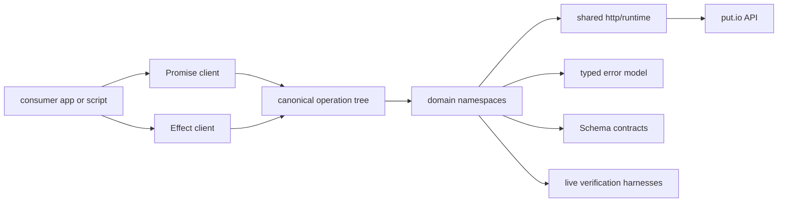

# SDK Overview

## System View

```mermaid
graph LR
  Consumer["consumer app or script"] --> Promise["Promise client"]
  Consumer --> EffectClient["Effect client"]
  Promise --> Operations["canonical operation tree"]
  EffectClient --> Operations
  Operations --> Domains["domain namespaces"]
  Domains --> Http["shared http/runtime"]
  Domains --> Errors["typed error model"]
  Domains --> Schemas["Schema contracts"]
  Http --> API["put.io API"]
  Domains --> Live["live verification harnesses"]
```

## Components

| Component           | Responsibility                                                 |
| ------------------- | -------------------------------------------------------------- |
| Promise client      | ergonomic app-facing entrypoint with managed runtime ownership |
| Effect client       | Effect-native entrypoint and service for workflows             |
| Domain namespaces   | grouped API operations by domain                               |
| Utilities subpath   | file URLs, localized errors, and shared formatting helpers     |
| Shared HTTP runtime | fetch-native transport, auth resolution, base URLs             |
| Error model         | transport, validation, and operation-aware failures            |
| Live verification   | runtime verification against real put.io accounts              |

## Namespace Layout

- `src/core/*.ts`: shared runtime, transport, defaults, and client composition
- `src/domains/*.ts`: domain namespaces
- `src/utilities/*.ts`: opt-in helpers exported from `@putdotio/sdk/utilities`

A domain stays one file until it grows large enough to earn its own subfolder.

## Direct Access and Upload

The `files` namespace owns both:

- JSON operations like `files.get(...)`, `files.list(...)`, `files.extract(...)`
- direct route helpers like `files.getApiDownloadUrl(...)`, `files.getApiContentUrl(...)`, `files.getHlsStreamUrl(...)`, `files.getHlsMasterPlaylist(...)`, and `files.getXspfPlaylistUrl(...)`
- upload helpers like `files.createUploadRequest(...)` and `files.upload(...)`

That split is deliberate:

- route helpers are transport-shaped
- JSON methods are schema-shaped
- upload is special because it goes through `upload.put.io`

## Runtime Model

| Concern      | Choice                                               |
| ------------ | ---------------------------------------------------- |
| Core runtime | `effect`                                             |
| Transport    | SDK-owned `PutioHttpClient` service over `fetch`     |
| Validation   | `Schema`                                             |
| Auth         | config token, explicit token, basic auth, or no-auth |
| Portability  | standard Web APIs first                              |

The Effect client is available as both a factory value and a `PutioSdk` service layer for workflows that prefer dependency injection.
`makePutioSdkLiveClientLayer(...)` composes the SDK service, SDK config, and fetch-backed transport for the normal live boundary.
Both clients are assembled from one typed operation tree. The Promise client adapts its Effect operations through one managed runtime per client instance, while keeping lifecycle methods, token replacement, overload-specific signatures, and pure helpers explicit. It exposes `dispose()` so host applications can tear the runtime down explicitly.

Every canonical-tree operation is classified as validated, input-free, or pure. Module initialization rejects an unclassified leaf, so a new request operation must explicitly acknowledge the boundary rule before it can join either public client. Validation remains owned by the domain operation, before transport serialization.
Operations derived through the generic Promise adapter also check the declared Effect/non-Effect return kind at call time. Explicit overload and schema adapters invoke their typed domain operations directly. The Effect client preserves canonical domain-function identity and relies on the classification helpers' compile-time return-kind constraint; it does not wrap calls with that runtime check.
Overload-specific Promise signatures remain explicit adapters; mixed Effect/pure overloads are unsupported.

## Verification Model

See [Testing](./TESTING.md#sdk-verification-strategy) for the verification layers and commands.
